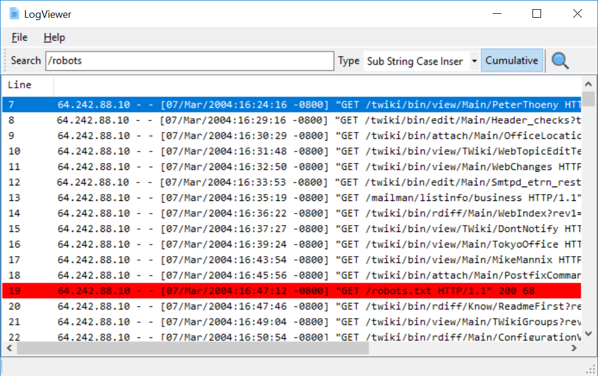

# LogViewer

LogViewer is designed to make working with log files quicker and easier, particularly for DFIR cases that involved log analysis. Whilst I use grep (well actually I use [sift](https://github.com/svent/sift) to extract data from logs, it is handy to be able to view log files, search for terms, hide lines whilst you get an idea what the log file contains, what actions are being performed.

I normally use a combination of various text editors, glogg, and the Mandiant Highlighter tool. The Mandiant Highlighter tool is great but hasn't been updated since 2011. It has lots of functionality, most of which I don't use. I wanted to implement my own log viewer and looked at the source code for Highlighter and realised it uses a custom owner drawn textbox, which is how it can work on large files.

So that is how LogViewer was born, by design it is simpler, it doesn't have field operations, it doesn't have the line view etc.

The use of the custom control would make debugging any future issues a lot harder, so after a bit of thought I used the [ObjectListView](http://objectlistview.sourceforge.net/cs/index.html) library. The ObjectListView library is a custom list view control for use with .Net projects, I have used it extensively as it is easy to use and works with large data sets.

The core operation of LogViewer works in the same way as Highlighter e.g. parse the file, find the line offsets and  line lengths, then when a line is needed for display, an existing file stream is used to seek to the offset, and then read X bytes.

I tested the v0.0.1 release of LogViewer against v1.1.3 of Mandiant Highlighter. My test log file was 1.2 GB and had 4.4 millions rows. The following shows the operation and duration of the operation to compare:

- Load (LogViewer): 15s
- Load (Highlighter): 42s
- Search (LogViewer): 1m 5s
- Search (Highlighter): 2m 15s
- Show Only Highlighted (LogViewer): 2s (+ the search operation above 1m 5s) Total: 1m 7s
- Show Only Highlighted (Highlighter): Killed after 35m

The main reasons for this being faster is that it has removed some functionality and I have optimised the file load code so that there is less memory allocation and unnecessary checks/logic, plus Highlighter does some Md5 calcs etc.

## Features

- Very fast
- Supports huge files
- Cumulative search
- Can disable/enable search terms that are cumulative and the results are displayed instantly
- Export current view
- Show/Hide matched lines
- Four search modes (Sub String Case Insensitive, Sub String Case Sensitive, Regex Case Insensitive, Regex Case Sensitive)

## General

- To stop an action such as load, search, export, you double click on the progress bar, located in the status bar
- The context menu holds the majority of actions
- Lots of stuff to be fixed/added! :-)

## Screenshot

